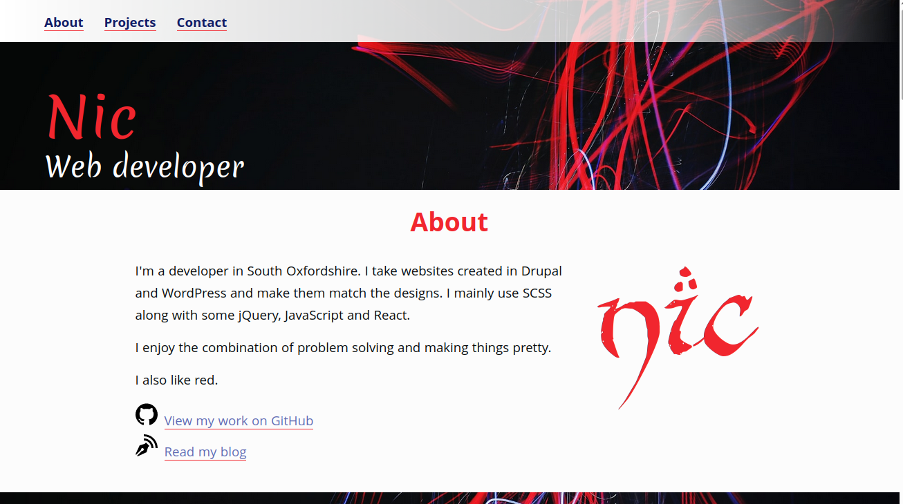

# Portfolio
> My portfolio to show off some of my projects

## Table of contents
* [General info](#general-info)
* [Screenshots](#screenshots)
* [Technologies](#technologies)
* [Learnings](#learnings)
* [Setup](#setup)
* [Status](#status)
* [Contact](#contact)

## General info
Just one page with my projects and some information about me and contact methods.

## Screenshots

## Technologies
* HTML
* SCSS
* JavaScript
* Gulp 4

## Learnings
* Figma
* SCSS

## Setup
To view this project visit the [site](https://nicm42.co.uk/) or download the files and open index.html

## Status
Project is: _in progress_ because there are always new projects to update

## Contact
Created by [nicm42](https://www.twitter.com/nicm4242) - feel free to contact me!
